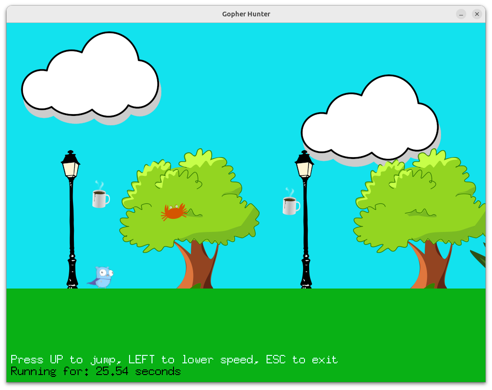

# Help the Gopher Escape from the Enemies

[**Cleuton Sampaio**](https://linkedin.com/in/cleutonsampaio)

[**ORIGINAL PORTUGUESE VERSION**](./README.md)

**Gopher** is the mascot of the **Go** programming language. In this simple game, programmed in **Go**, I demonstrate the main techniques for 2D games using the [**Pixel**](https://github.com/gopxl/pixel/tree/main) library.

## Build and Run

You need to have the **Go** platform installed (version 1.23 or higher). This game was developed on the **Ubuntu** 24.04 LTS operating system and tested on **MacOS** 15 (Sequoia). I haven’t tested it on Microsoft **Windows**, but it should be able to run there. Refer to the [**Pixel**](https://github.com/gopxl/pixel/blob/main/docs/Compilation/Building-Pixel-on-Windows.md) library instructions for details.

Clone the repository, open the `src` folder, and run the following command:

```shell
go mod tidy
``` 

Then compile or run the program:

```shell
go run main.go
``` 

## Brief Explanation of the Source Code

This game, called **"Gopher Hunter"**, is an example of a 2D game created with the **Pixel** library, which is a library for 2D graphics in Go. Let’s start with an overview of the game:

### **Game Structure and Concepts**

1. **Basic Components of a 2D Game:**
   - **Sprites**: Images are loaded and divided into smaller parts (sprites) that represent characters and elements of the game, such as the player (a gopher), NPCs (snakes, crabs, cups), and the background.
   - **Background Scrolling**: The game includes a moving background to create the illusion of movement while the player stays in a fixed position.

2. **Main Character:**
   - The **player** can perform actions such as jumping (`KeyUp`) or slowing down (`KeyLeft`). These actions affect the player’s behavior in the game.
   - The player’s movement is based on simple physics, such as gravity to control jumping and height limits.

3. **NPCs (Non-Player Characters):**
   - There are 3 types of NPCs: snakes, crabs, and cups.
   - Each NPC has unique behavior. For example:
     - Crabs (**Rust**) are faster and can jump.
     - Snakes (**Python**) move only horizontally but are long.
     - Cups (**Java**) fly at different speeds.
   - All NPCs share common properties, such as position and collision detection.

4. **Collisions:**
   - The game checks for collisions between the player and NPCs. If a collision is detected, the game displays a "Game Over" screen with options to restart or exit.

5. **Game Logic:**
   - The game runs in a main loop where:
     - Time (`dt`) is calculated to ensure smooth updates.
     - Background elements and NPCs are moved and drawn.
     - New NPCs are launched periodically.
     - Player inputs are captured to trigger actions.

6. **Graphics and Windows:**
   - The Pixel library is used to create a window, draw sprites, and handle 2D graphics.
   - Text is displayed on the screen using a basic font for instructions and information such as elapsed game time.

7. **Important Functions:**
   - **`loadPicture`**: Loads images and converts them into sprites.
   - **`move` and `draw`**: Control the movement and rendering of NPCs and the player.
   - **`collide`**: Checks for collisions using bounding rectangles.

### **Concepts Related to 2D Games**
- **Side-Scrolling**: The background moves to create the sense of progress, a common concept in 2D games.
- **Simple Physics**: Includes vertical acceleration for the player’s jump and horizontal limits for elements.
- **Main Loop**: The game is structured around a continuous loop that processes inputs, updates states, and redraws the screen.
- **Spritesheets**: Larger images are divided into smaller sections for animations and efficient use of graphical resources.

This game demonstrates how to structure a basic 2D game, focusing on organization, simple physics, and interactivity using the **Pixel** library as the graphical foundation.

## Implementation Details

The implementation of the game using the **Pixel** library is well-structured to take advantage of its graphical and event management features. Let’s associate the game’s functionality with the resources provided by Pixel:

### **1. Window Management and Configuration**
- **Pixel provides:** Tools for creating and managing the game window through the `opengl` package.
- **In the code:**
  - The window is configured and created using `opengl.WindowConfig` and `opengl.NewWindow`, defining dimensions, position, title, and vertical synchronization (VSync).
  - Example:
    ```go
    cfg := opengl.WindowConfig{
        Title:    "Gopher Hunter",
        Bounds:   pixel.R(0, 0, 1024, 768),
        Position: pixel.V(posX, posY),
        VSync:    true,
    }
    win, err := opengl.NewWindow(cfg)
    ```
  - **Associated function:** `run()` initializes and controls the game’s main loop, using the window to render elements.

### **2. Sprite Management**
- **Pixel provides:** The `pixel.Sprite` type for representing images and methods for rendering them on the screen.
- **In the code:**
  - Sprites are loaded from images (with `loadPicture`) and created from **spritesheets**, which divide larger images into smaller parts.
  - Example:
    ```go
    snakeSprites = append(snakeSprites, pixel.R(x, y, x+128, y+31))
    ```
    This creates sub-images (sprites) for the snakes.
  - Sprites are rendered on the screen using the `Draw` method:
    ```go
    element.Draw(win, matrices[i])
    ```

### **3. Movement and Transformations**
- **Pixel provides:** The `pixel.Matrix` type for performing transformations like translation, rotation, and scaling.
- **In the code:**
  - Elements like NPCs and the background use transformations to move horizontally or simulate screen scrolling.
  - The `Moved` method creates a translation matrix:
    ```go
    matrices[i] = matrices[i].Moved(pixel.V(-backSpeedFactor*dt, 0))
    ```
    This moves the background to the left.

### **4. Event Handling**
- **Pixel provides:** Methods to detect keyboard and mouse inputs.
- **In the code:**
  - Events capture player actions, such as jumping (`KeyUp`) or slowing down (`KeyLeft`):
    ```go
    if win.JustPressed(pixel.KeyUp) {
        player.isJumping = true
    }
    ```
  - The `JustPressed` method checks if a key was pressed.

### **5. Collision Detection**
- **Pixel provides:** Tools for manipulating vectors (`pixel.V`) and rectangles (`pixel.Rect`), essential for collision detection.
- **In the code:**
  - Collisions are detected using the `Intersect` method, which calculates the intersection between two rectangles:
    ```go
    collision := elementRect.Intersect(rect)
    return collision.Area() > 0
    ```

### **6. Time Management**
- **Pixel provides:** Integration with Go’s standard `time` package for measuring and controlling time.
- **In the code:**
  - The time interval (`dt`) between frames is calculated to ensure smooth movements:
    ```go
    dt := time.Since(last).Seconds()
    ```
  - This is used to adjust NPC speeds and animation durations.

### **7. On-Screen Text**
- **Pixel provides:** The `text` package for creating and managing text.
- **In the code:**
  - Texts such as elapsed time or game-over messages are drawn using `text.New`:
    ```go
    fmt.Fprintf(seconds, secondsText, secondsRunning)
    seconds.Draw(win, pixel.IM.Scaled(seconds.Orig, 2))
    ```

### **8. Key Structures and Functions**
- **Structures:**
  - `Player` and NPCs (`Snake`, `Crab`, `Cup`) share a base structure (`CommonNpcProperties`) with common properties such as position, size, and speed.
  - Each NPC type implements unique behaviors for movement (`move`), rendering (`draw`), and collision detection (`collide`).
- **Functions:**
  - **`move(dt float64)`**: Updates the position of NPCs and the player based on time.
  - **`draw(pixel.Target)`**: Renders the element on the screen.
  - **`loadPicture(path string)`**: Loads images from disk to be used as sprites.

### **Summarizing Pixel’s Role in the Implementation**
The **Pixel** library simplifies game development by providing tools to:
1. Create and manage the game window.
2. Handle sprites and animations.
3. Detect keyboard events.
4. Implement collisions and smooth movements.
5. Add elements like text and dynamic graphics.

This combination of resources allows the game to be structured around a **main loop**, focusing on player interaction, smooth animations, and a rich visual environment.

## Code Structure

The code structure follows a typical approach for 2D games, where elements are well modularized with clear responsibilities and component reuse. Here’s an explanation of the structure:

### **1. Initial Setup and Global Variables**
- **Purpose:** Define configurations and store the global state of the game.
- **Main Elements:**
  - Global variables like `player`, `npcs`, `elements`, and `secondsRunning` store the state of the player, enemies, visual elements, and game time.
  - Configurations for speed, initial position, and element properties are declared for easy adjustments.
  - Example:
    ```go
    backSpeedFactor := 50.0
    crabSpeed := 120.0
    playerJumpLimit := 500.0
    ```

### **2. Data Structures**
- **Purpose:** Model the main elements of the game.
- **Main Elements:**
  - **`CommonNpcProperties`:** A base structure containing common properties for NPCs and the player, such as position, speed, and size.
    ```go
    type CommonNpcProperties struct {
        sprite1       *pixel.Sprite
        sprite2       *pixel.Sprite
        position      pixel.Vec
        height        float64
        width         float64
        speed         float64
        horizontalWay float64
        inverted      bool
    }
    ```
  - **Specific NPCs:** Structures like `Crab`, `Snake`, and `Cup` extend `CommonNpcProperties` to implement unique behaviors, such as jumping for `Crab`.
  - **`Player`:** The player has specific behaviors like jumping and slowing down, with its own movement logic.

### **3. Interfaces**
- **Purpose:** Ensure all NPCs share a common set of behaviors.
- **Main Elements:**
  - The `Npc` interface defines methods that each NPC must implement:
    ```go
    type Npc interface {
        move(dt float64) bool
        draw(pixel.Target)
        collide(pixel.Rect) bool
    }
    ```
  - This facilitates polymorphism and generic manipulation of NPCs in the game.

### **4. Behavior Functions**
- **Purpose:** Implement the main logic for NPCs and the player.
- **Main Elements:**
  - **`move(dt float64) bool`:** Updates the position of elements based on time.
  - **`draw(pixel.Target)`:** Draws the element on the screen.
  - **`collide(pixel.Rect) bool`:** Checks for collisions between elements.
  - Example of collision logic:
    ```go
    func (c CommonNpcProperties) collide(rect pixel.Rect) bool {
        lowerLeft := pixel.V(c.position.X-c.width/2, c.position.Y-c.height/2)
        upperRight := pixel.V(c.position.X+c.width/2, c.position.Y+c.height/2)
        elementRect := pixel.R(lowerLeft.X, lowerLeft.Y, upperRight.X, upperRight.Y)
        collision := elementRect.Intersect(rect)
        return collision.Area() > 0
    }
    ```

### **5. Helper Functions**
- **Purpose:** Perform specific tasks like loading images or initializing elements.
- **Main Elements:**
  - **`loadPicture(path string)`**: Loads images and converts them into `pixel.Picture` for game use.
  - **NPC Constructors (`NewSnake`, `NewCrab`, `NewCup`)**:
    - Create NPC instances by loading spritesheets and setting specific properties.
    - Example:
      ```go
      func NewSnake() *Snake {
          return &Snake{
              CommonNpcProperties{
                  sprite1: pixel.NewSprite(snakeSpriteSheet, snakeSprites[0]),
                  sprite2: pixel.NewSprite(snakeSpriteSheet, snakeSprites[1]),
                  position: pixel.V(1024, 200+31/2),
                  speed: snakeSpeed,
              },
          }
      }
      ```

### **6. Game Initialization**
- **Purpose:** Set up the initial environment before the main loop.
- **Main Elements:**
  - The `initGame()` function resets global variables and reconfigures the game state.
  - Example:
    ```go
    func initGame() {
        elements = []*pixel.Sprite{}
        npcs = []Npc{}
        secondsRunning = 0.0
    }
    ```

### **7. Game Main Loop**
- **Purpose:** Control the flow of the game, including player input, updates, and rendering.
- **Main Elements:**
  - The `run()` function implements the main loop, which runs until the window is closed:
    - Calculates the time (`dt`) between frames for smooth movement.
    - Processes keyboard inputs.
    - Updates positions of elements (player, NPCs, and background).
    - Checks for collisions and ends the game in case of impact.
    - Draws all elements on the screen.
  - Example:
    ```go
    for !win.Closed() {
        dt := time.Since(last).Seconds()
        last = time.Now()
        player.move(dt)
        player.draw(win)
    }
    ```

### **8. Game Over and Restart**
- **Purpose:** Display a "Game Over" screen and allow the player to restart or exit.
- **Main Elements:**
  - After a collision, the game displays a message and options to continue:
    ```go
    if npc.collide(player.rect()) {
        for !win.Closed() {
            basicTxt.Draw(win, pixel.IM.Scaled(basicTxt.Orig, 3))
            if win.JustPressed(pixel.KeyY) {
                initGame()
            }
        }
    }
    ```

### **Structure Summary**
- **Modular Organization:** Clear separation between initialization, NPC behavior, the main loop, and state management.
- **Reuse:** Extensive use of common structures and interfaces to avoid code repetition.
- **Defined Game Cycle:** Initialization → Main Loop → End/Restart.

This modular structure facilitates game maintenance and expansion, allowing new elements or mechanics to be added without significant changes.